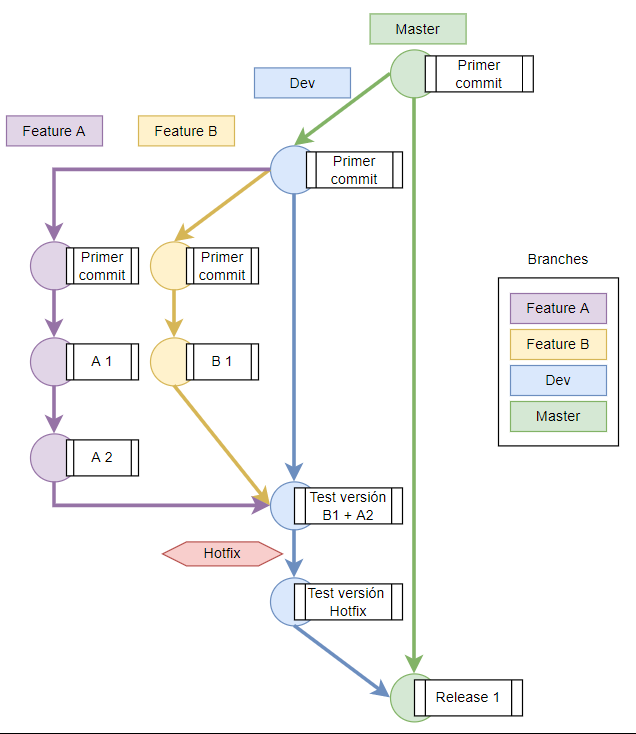

# Branching Strategy


## Problemática:

Hasta ahora se ha estado trabajando con la de herramienta de versionado de subversión sobre una misma rama (Master) y de manera excepcional se generaban ramas para trabajar las características. Al ir aumentando el equipo de desarrollo esta forma de trabajo resulta ineficiente. Tampoco se encontraba definido el momento en que se actualiza el repositorio (antes o después de una publicación). Por todo esto y aprovechando la migración a GIT vemos la oportunidad de establecer una estrategia clara de desarrollo en equipo y que sirva de base para futuras mejoras.


## Estrategia:

Para nuestros repositorios seguiremos la metodología de tener un branch principal 'master', un branch 'dev' para comprobar que todo funcione antes de enviar los cambios a master y múltiples 'feature' branches para que cada colaborador pueda encargarse de una tarea definida, trabajarla y probarla a gusto antes de reunir los cambios en 'dev'.  

Si durante el testeo de la rama Dev detectamos algún problema se deberá trabajar en su rama correspondiente, a menos que sea un error pequeño y se pueda solucionar de forma ágil, en estos casos lo haremos sobre Dev a modo de Hotfix.


[](@site/static/img/bs.png)


En este ejemplo hemos representado dos branches de Features: Features A y Features B. También hemos hecho uso de los hotfixes para representar como se realizarían en nuestra estrategia.


Paso a paso:

Para llegar del 'Primer commit' al 'Release 1' se realizan los siguientes pasos:

- 1 - Realizar el primer commit del código al Master, este commit debería de ser la última versión productiva. (Una sola vez al comienzo para generar la arquitectura)

- 2 - Creamos la rama Dev a partir de la rama Master, al hacerlo tendremos el mismo código en ambas ramas.  (Una sola vez al comienzo para generar la arquitectura)

- 3 - Creamos ramas de Features para empezar a desarrollar, esto se realiza siempre que se necesite desarrollar una nueva características, en un feature podrán trabajar varias personas al mismo tiempo si es necesario. Al crearlas lo haremos a partir de la rama Dev.

- 4 - Ejemplo: desarrollamos en la rama 'Feature A' la característica [A 1], una vez terminada nos interesa hacer un commit en la rama 'Feature A', para ello haremos un commit local y push a la rama:

``` bash
git add *
git commit -m "A 1"
git push
```

Para el desarrollo de la característica [A 2] realizaríamos los mismos pasos, así como se harán en la rama 'Feature B' para la característica [B 1].

- 5 - Terminados los desarrollos de 'Feature A' y 'Feature B' los pasaremos a preproducción 'Dev'. Para ello debemos hacer un merge donde uniremos las características desarrolladas con Dev.

Nos posicionamos en la rama Dev:

``` bash
git checkout Dev
git merge Feature A
git merge Feature B
git push
```

- 6 - Podemos desplegar una versión de prueba del código que se encuentra en la rama Dev, si hay algún problema lo solucionamos de la siguiente manera:

- 6.1 - Si el problema es de ágil solución: Desarrollamos el cambio en la misma rama y hacemos un push, a esto lo llamamos 'Hotfix', tras ello volvemos al paso 6.

``` bash
git add *
git commit -m "Test versión Hotfix"
git push
```

- 6.2 - Si el problema no es de ágil solución: Desarrollamos los cambios en la rama o ramas correspondientes, para ello actualizamos el estado de estas ramas con la última versión de Dev. Tras ello volvemos al paso 6.

``` bash
git checkout Feature A
git merge Dev
git push
```

- 7 - Si todo funciona correctamente hacemos merge de la rama Dev a la rama Master, una vez realizado esto podemos publicar en producción.


